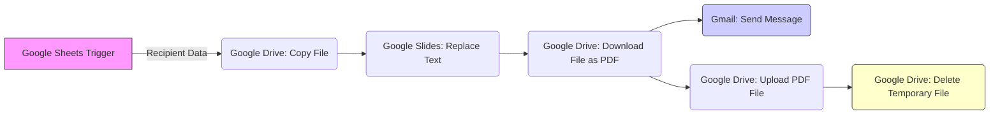

# Automated Digital Credentials Generator (n8n & Google Workspace)

## Project Overview

This project implements a fully automated, scalable workflow for generating and distributing personalized digital certificates using the low-code automation platform **n8n**. The system eliminates the manual effort and human error associated with administrative tasks like document personalization, conversion, archiving, and email delivery, leveraging the power of Google Sheets, Google Slides, Google Drive, and Gmail APIs.

**Project Title:** A Workflow Implementation for Personalized Certificate Generation and Distribution using n8n and Google Workspace

---

## Acknowledgements

We extend our sincere thanks to all contributors who helped make this project possible:

* **Aashna Ferrao**
* **Alroy Vishanth Dsouza** 
* **Aroma Peris**
* **Jeethan Roche** 

## Prerequisites

Before setting up the workflow, ensure you have the following:

1.  **n8n Instance:** A running instance of n8n (self-hosted or using a cloud service).
2.  **Google Workspace Account:** An active Google account with access to Sheets, Slides, Drive, and Gmail.
3.  **Google Cloud Project:** A dedicated project in Google Cloud Console to generate the necessary API credentials.
4.  **Team Data:** A list of participant details (**Name**, **Email**, **Course**, etc.) ready in a **Google Sheet**.
5.  **Certificate Template:** A **Google Slides** presentation file to be used as the certificate template.

---

## 🛠️ Setup and Configuration

### Step 1: Prepare Google Workspace Resources

#### 1.1 Create the Template and Data Sheet

* **Google Sheet (Data Source):** Create a new Google Sheet. The column headers must **exactly match** the placeholders in your Google Slides template (e.g., `Name`, `Email`, `Course`).
* **Google Slides (Template):** Create your certificate template. Use double curly braces `{{ }}` for placeholders (e.g., `{{Name}}`, `{{Course}}`).
* **Google Drive Folders:** Create three folders in Google Drive:
    1.  `Master Template Folder`
    2.  `Temporary Working Folder`
    3.  `Final Certificate Archive`

#### 1.2 Setup Google API Credentials

1.  Navigate to the **Google Cloud Console**.
2.  Enable the following APIs for your project:
    * **Google Drive API**
    * **Google Slides API**
    * **Gmail API**
3.  Create an **OAuth 2.0 Client ID** credential to obtain the Client ID and Client Secret.

### Step 2: Configure n8n Credentials

1.  In your n8n instance, go to **Credentials**.
2.  Add a new **Google** credential.
3.  Enter the **Client ID** and **Client Secret** obtained in Step 1.2.
4.  When prompted, authorize the n8n application using your Google Account. Ensure you grant permissions for **Google Drive**, **Google Slides**, and **Gmail**.

### Step 3: Import and Configure the n8n Workflow

1.  Import the workflow JSON file.
2.  Go through each node and update the configuration, paying special attention to file IDs and expressions:

| n8n Node | Action | Configuration Detail |
| :--- | :--- | :--- |
| **Google Sheets Trigger** | `Trigger on new data` | Select your Google Sheet and the relevant sheet name. |
| **Copy file** | `Copy file` | Set the `File ID` to the ID of your **Master Certificate Template** Slides file. |
| **Replace text in a presentation** | `Replace text` | Set the text mapping: map Google Sheet headers (e.g., `{{ $json.Name }}`) to the template placeholders (e.g., `{{Name}}`). |
| **Download file** | `Download file` | Ensure the `File Format` is set to **PDF**. |
| **Send a message** (Gmail) | `Send Message` | Configure the `To` field using an expression (e.g., `{{ $json.Email }}`). Attach the binary output from the **Download file** node. |
| **Upload file** | `Upload file` | Set the `Destination Folder ID` to the ID of your **Final Certificate Archive** folder. |
| **Delete a file** | `Delete file` | This node cleans up the temporary file created by the **Copy file** node. |

---

## Execution

1.  **Manual Execution (Testing):** Click the **Execute Workflow** button in the n8n interface to process data for testing.
2.  **Automatic Execution (Production):** Ensure the **Google Sheets Trigger** is set to **Active**. The workflow will run automatically whenever new data is added to the monitored sheet.

---

## Workflow Architecture (High-Level)

The system is a linear, event-driven pipeline that ensures sequential data processing and resource management.

## Resources
- n8n Documentation: https://docs.n8n.io/

- Google Sheets API: https://developers.google.com/sheets/api

- Google Slides API: https://developers.google.com/slides/api

- Google Drive API: https://developers.google.com/drive/api
